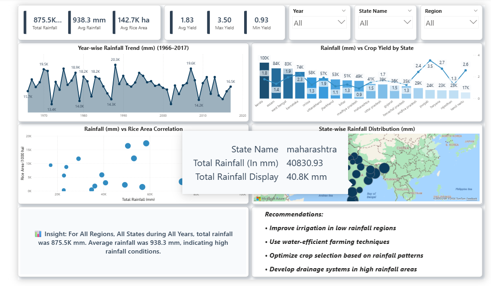
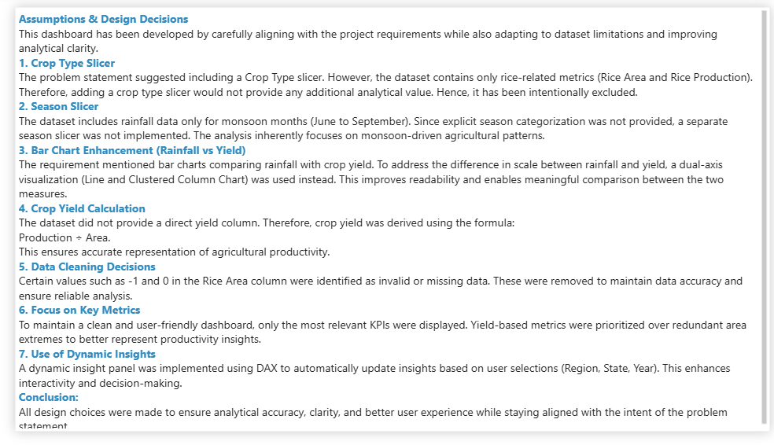

# Rainfall & Agricultural Productivity Analysis (Power BI)

This project analyzes rainfall patterns and their impact on agricultural productivity using Power BI.

## Key Features
- Data cleaning and preprocessing
- DAX-based crop yield calculation
- Trend, correlation, and regional analysis
- Dual-axis comparison (Rainfall vs Yield)
- Dynamic insights and recommendations

## Dashboard Preview

## Tools Used
- Power BI
- DAX
- Data Modeling

## Author
Jitendra Singh (JSK)
